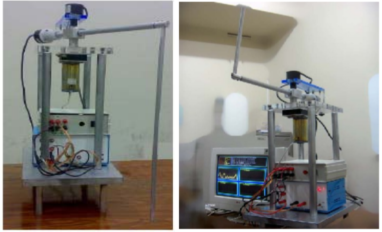

##### Download

+ [Patent Description [In Farsi]](patent_description.pdf)
+ [Conference Paper](FIP_paper.pdf)
+ Video: [Furuta Inverted Pendulum](https://youtu.be/yYVXt_WMABs)

---

##### Abstract

This work is carried out by a group of students, as 
part of the Mechatronics graduate course at Iran University of Science and Technology. A new fuzzy controller based on the idea of energy control is proposed, to swing up the inverted pendulum to the upright position. Furthermore, a model-based parallel distributed compensation (PDC)  scheme is employed to stabilize the pendulum at its unstable equilibrium point, while the position of the arm is also controlled. Experimental results show the outstanding 
stability, performance and robustness of the controlled system. 

---
##### Figures: Rotary(Furuta) Inverted Pendulum

