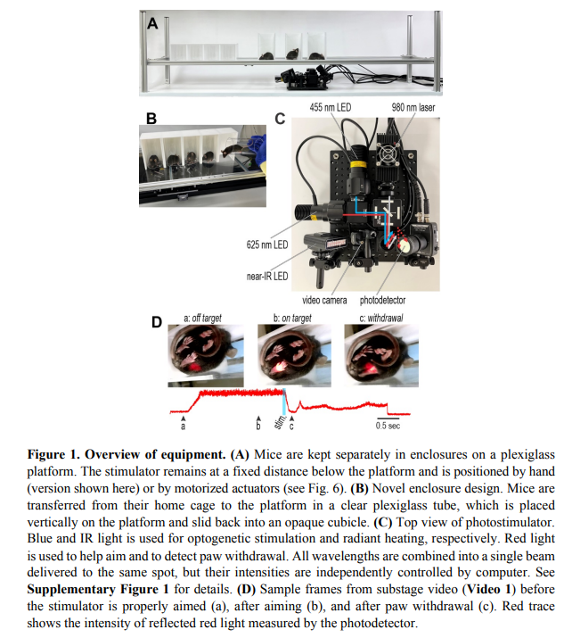
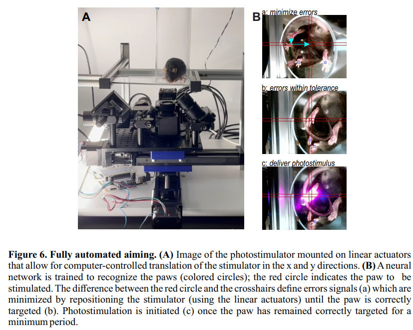

---

##### Download

+ [Patent (to be uploaded after acceptance)]()
+ [Code and data](https://github.com/stofe95/ramalgo)
+ Videos
    - [Fully Automated Testing](https://www.youtube.com/watch?v=NirNM9OIvPY)
    - [Automated Aiming](https://www.youtube.com/watch?v=litHopqaGCk)

---

##### Abstract

Pain in rodents is often inferred from their withdrawal from noxious stimulation. Threshold stimulus intensity or response latency is used to quantify pain sensitivity. This usually involves applying stimuli by hand and measuring responses by eye, which limits reproducibility and throughput. We describe a device that standardizes and automates pain testing by providing computer-controlled aiming, stimulation, and response measurement. Optogenetic and thermal stimuli are applied using blue and infrared light, respectively. Precise mechanical stimulation is also demonstrated. Reflectance of red light is used to measure paw withdrawal with millisecond precision. We show that consistent stimulus delivery is crucial for resolving stimulus-dependent variations in withdrawal and for testing with sustained stimuli. Moreover, substage video reveals ‘‘spontaneous’’ behaviors for consideration alongside withdrawal metrics to better assess the pain experience. The entire process was automated using machine learning. RAMalgo (reproducible automated multimodal algometry) improves the standardization, comprehensiveness, and throughput of preclinical pain testing.

---
##### Figures:

---
