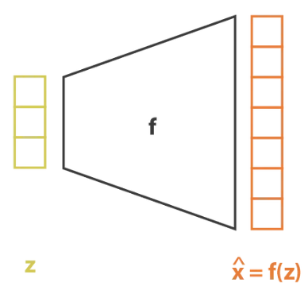
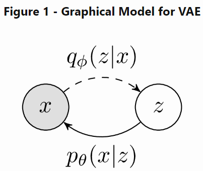

+++
title = 'Looking at VAE from Diffetent Perspective'
date = 2023-12-10
author= ["Mehdi Azad"]
summary = "This post explores VAE architecture starting from manifold hypothesis. Then, I provide minimum math to derive ELBO loss."
+++

# Introduction

This post explores VAE architecture starting from manifold hypothesis. Then, I provide minimum math to derive ELBO loss.

# Manifold Hypothesis

According to the **manifold hypothesis**, most of the data is expected to concentrate in a low dimensional manifold, even though the observed data might look only arbitrarily high-dimensional.

Note:  the manifold hypothesis is basically for natural data. Fore example, a set of possible images is infinite; however, the set of images of natural faces of people is a tiny subset. They can be expressed in a manifold space having the dimension in the order of the number of muscles in the face, i.e., ~50.

# VAE architecture

So, based on manifold hypothesis, I may say that my data comes form a low-dimentional space ($z$). 

There are some considerations here: 

 

1. what is the distribution on data in $z$ space? I can get away with this problem byassuming that $p(z)=\mathcal{N}(0, I)$
2. How we can train this system? What is $(z,x)$ pair? I don’t have answer for this question. I need to somehow find out the associatoin between $z$ and $x$. 
3. The function above models $p(x|z)$. Howerver, I have to marginalize over $z$, inorder to find $p(x)$.
    
    $$
    p(x)= \sum_{z} p(z)p(x|z)
    $$
    
Note: In order to see the output of the model as a distribution, you can assume $f(Z)$ as the mean value of that distribution with the variance equal to one.
    
I can use Mont Carlo technique to sample from $z$ space and approximate the summation above. However, in high dimentional space the summation is not tractable. On the other hands for most of the $z$s, $p(x|z)$ is equal to zero. So, it would be intresting if I could find the $z$s which are likely to generate $x.$ 
    
The VAE solves these problems by sampling $z$ from a new distribution $q(z|x)$, which is jointly optimised with the generative model. This focuses the optimisation on regions of high probability (i.e. latent codes that are likely to have generated $x$).
    

    
$$
p(x) = \int_{z}p_{\theta}(x|z)p(z)
$$
    
$$
p(x) = \int q_{\phi}(z|x) \frac{p_{\theta}(x|z)p(z)}{q_{\phi}(x|z)}
$$
    
$$
\log p(x)= \log E_{z \sim q_{\phi}(z|x)} \Biggl[ \frac{p_{\theta}(x|z)p(z)}{q_{\phi}(x|z)} \Biggr]
$$
    
following Jensen’s inequality, i.e., $ E(Ln(X)) \leq Ln(E(X))$:
    
$$
\log p(x) \geq E_{z \sim q_{\phi}(z|x)} \Biggl[ \log \frac{p_{\theta}(x|z)p(z)}{q_{\phi}(x|z)} \Biggr]
$$
    
The right-hand side of this inequality is the evidence lower-bound (ELBO). 
    
The ELBO provides a joint optimisation objective, which simultaneously updates the variational posterior $q(z|x)$ and likelihood model $p(x|z)$. 
    
We can simplify the above equation: 
    
$$
\log p(x) \geq E_{z \sim q_{\phi}(z|x)} \Biggl[ \log \frac{p(z)}{q_{\phi}(x|z)} \Biggr] + E_{z \sim q_{\phi}(z|x)} \Biggl[ \log p_{\theta}(x|z) \Biggr]
$$
    
The first term of ELBO is the KL divergence between $q(z|x)$ and normal distribution, and the second term is reconstruction error.