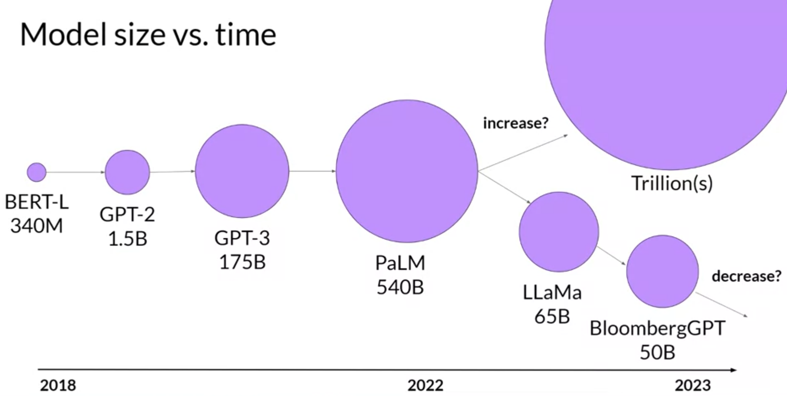
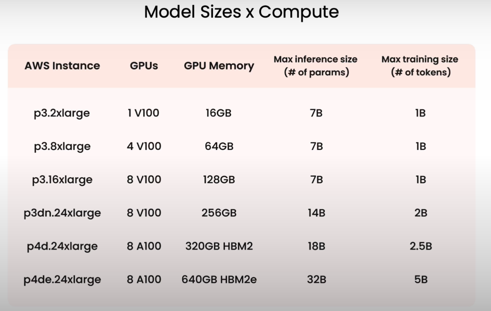
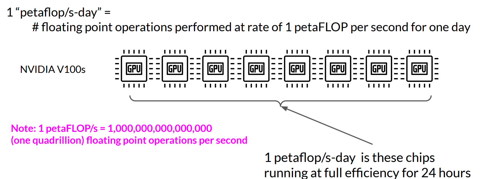
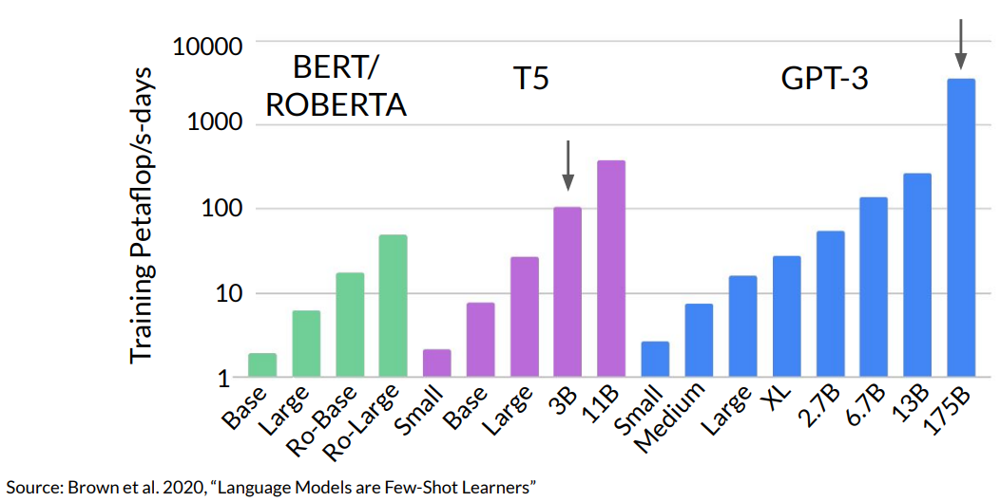
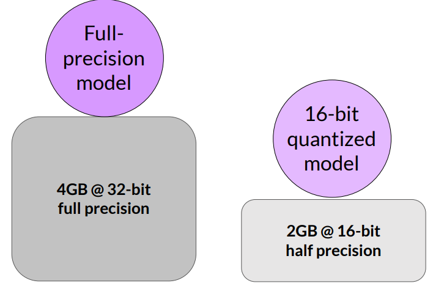
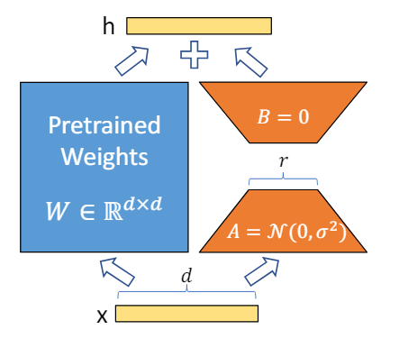

+++
title = "Back-of-the-envelope calculation for GPU requirements of LLMs"
date = 2024-06-20
author= ["Mehdi Azad"]
summary = "Making sense of LLMs' scale regarding computing resource requirements. How many GPUs are required to store and train LLMs and how can I make these requirements more efficient."
+++

# Introduction

Questions: 

1. How many GPUs are required to store and fine-tune LLMs? (Given NVIDIA V100 GPU with 32GB memory)?
2. How long does it take to pre-train LLMs?
3. How compute efficient methods such as qantization or LoRA can reduce the required GPU resources? 

# Compute Power: GPU memory requirement

## GPU RAM needed to train a model with 1B parameters

Let’s do some quick math

1 parameter = 4 bytes (32-bit float)

1B parameters = 4 x 10^9 bytes = 4GB (***storing*** the model)

> Note: we can use quntization to reduce memory usage to half. Take a look at Compute Efficiency section.
> 

However, if I want to train the model, let’s say in fine-tuning phase, I have to store other overhead parameters such as optimizer states or gradients during training.

<aside>
💡 memory required during training the model = x6 times the memory required to store the model weights alone (see the appendix for calculation)

</aside>

> Note: We can use LoRA to reduce memory usage during the training by 3 times. Take a look at Compute Efficiency section. So as a rule of thumb I can say that I need 2 times more memory for training (instead of  6 times) = 8GB.
> 

<aside>
💡 1B parameters = 4GB memory (to store the model weights for inference)
</aside>

<aside>
💡 1B parameters = 24GB memory (to train the model)
</aside>

+
Here is the size of the models that some AWS instances can handle. 

## GPU RAM needed to train larger models

Assumptions: 

- I can used **NVIDIA V100 GPUs with 32 GB** internal memory and
- I have the following equations: 1B = 4GB (for inference) / 1B =24GB (for training - fine tuining)

|  | No. of Parameters | No. of GPU (inference) | No. of GPU (training) |
| --- | --- | --- | --- |
| GPT-2 | 1.5B  | 1  | 2 | 
| GPT-3 | 175B | 22  | 132 | 
| PaLM | 540B | 68 | 405 | 
| LLaMa | 65B | 9 | 49 | 
| BloombergGPT | 50B | 7 | 38 | 

Note * : Take a look at Compute Efficiency section to see how we can reduce the number of GPUs for training the LLMs.

So for large models it becomes imposible to train them on a single gpu. This requires access to ***tens*** to ***hunderds of GPUs***. As a result we need to use distributed computing techniques to train the models across multiple GPUs. 

In summary, the order of magnitude of the number of GPUs required to train an LLM is approximately equal to the number of parameters in billions. For a model with ~100 billion parameters, the number of GPUs required is also in the order of hundreds.

# Pre-training Time

Above calculations can give us good estimation of compute requirements if we want to train the model in fine-tuning phase. At this phase we can re train the model in a supervised manner with limited number of labeled data. For example, single task fine-tuning can be done with 500 -100 data points and for multitask fine tuning we need around 5000 - 10000 data points.

However, pre-training phase has been carried out on vast amount of data in an unsupervised manner. For example, for GPT-3 the training dataset contained ~300B tokens. 

> Note: with chinchila scaling laws (data set size = x20 times the number of parameters) GPT-3 is underteained and it should have been trained on ~3.5T tokens.
> 

In this section I want to do some calculations to determine how much compute resources is required for pre-training LLMs. 

Unit of compute that quantifies the required recourses = 1 petaflop/s-day

Note: 1 petaflop/s-day = 1,000,000,000,000,000 floating point operations per second

<aside>
💡 1 petaflop/s-day = 8 NVIDIA V100 GPUs operationg at full efficiency for one day

</aside>

Copute resouces required vs. the models

We can increase the compute budget by adding more gpus or running the model longer.

| | | |
| --- | --- | --- |
| T5 (3B) | 100 petaflop/s-days = 800 GPU-days | 100 GPUs in 8 days |
| GPT3 (175B) | 3700 petaflop/s-days = 3700 x 8 GPU-day = 29600 GPU-days | 987 (~1000) GPUs in 30 days |

# Compute efficiency

**Quantization** is a technique to reduce the memory requirements. We do this by reducing the precision from 32 bits floating point numbers to 16 bits floating point numbers. By quantization we can have 50% saving in the memory consumption. 

 

**LoRA** (Low Rank Adaptation) also reduces the memory required for training.  This is one of the PEFT(Parameter Efficient Fine Tuning) techniques. In LoRA we freeze most of the original LLM weights and then inject two rank decomposition matrices and train the weights of the smaller matricis. 

LoRA allows us to reduce significantly the trainable parameters (from GB to even MB) we can sometimes perform this method on a single GPU!!!. 

For example, ***using LoRA, the trainable parameters for GPT-3 will be reduced roughly by 10,000 times and GPU memory requirements by three times*** [1]. Moreover, they also observe a 25% speedup during training on GPT-3 175B compared to full fine-tuning, as there is no need to calculate the gradient for the vast majority of the parameters.

As we can see in the first table for GPT-3 I need 22 GPUs for inference and 132 GPU for training / fine-tuning (x6 times the inference). But, with LoRA instead of 175B we need 175,000,000,000 / 10,000 = 17,500,000 trainable parameters. As it’s shown in appendix section each traibable prameters add 20 bytes to the memory during trainin.

17,500,000 x 20 bytes = 350,000,000 bytes = 350 MB

So instead of 132 - 22 = 110 more GPUs, with LoRA, I need just 1 more GPU to train the model. 

More over 25% speedup during training is substantial especially for pre-training phase. As I have calculated in the previous section, we need 100 GPUs for 30 days to pre-train GPT-3. However, by this speed up I can either reduce the time to 22.5 days or reduce the number of GPUs to 750.

QLoRA combines quantization and LoRA to further reduce the memory requirements. 

# Appendix

## Additional GPU RAM needed to train 1B parameters

|  | Bytes per parameter |
| --- | --- |
| Model Parameters (Weights) | 4 bytes per parameter |
| Adam optimizer (2 states) | +8 bytes per parameter |
| Gradeints | +4 bytes per parameter |
| Activations and temp memory (variable size) | +8 bytes per parameter (high-end estimate) |
| Total | = 4 bytes per parameter + 20 extra bytes per parameter =  |

 To account all of these overhead during training we need 24 bytes which is 6 times the amount of GPU memory needed to store  model weights alone (4 bytes).

# Reference

1- Edward J. Hu et al. 2021, “LoRA: Low-Rank Adaptation of Large Language Models”

2-  DeepLearning.AI, lecture notes, Generative AI with Large Language Models (for images)