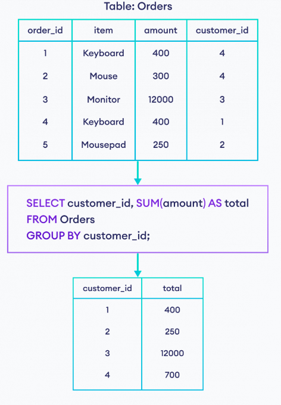
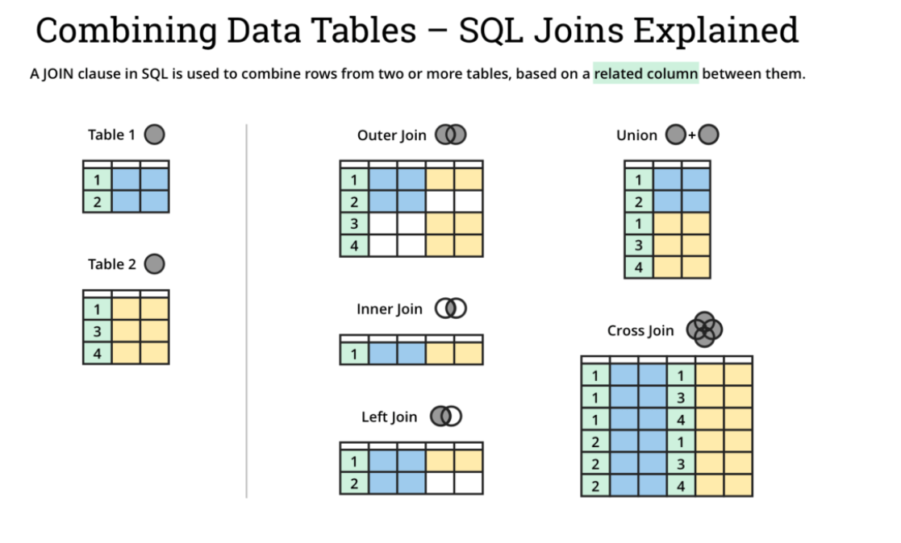
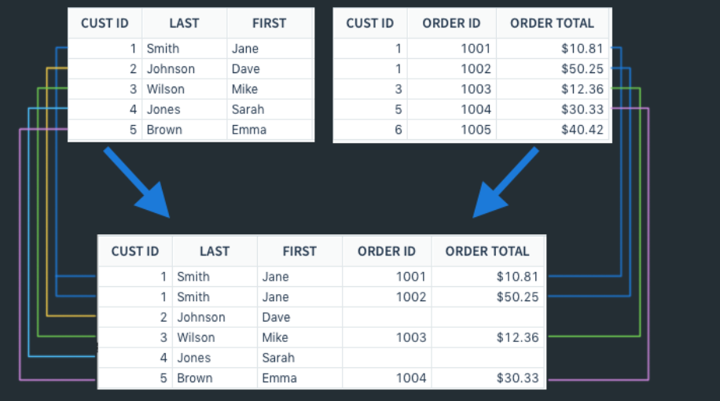
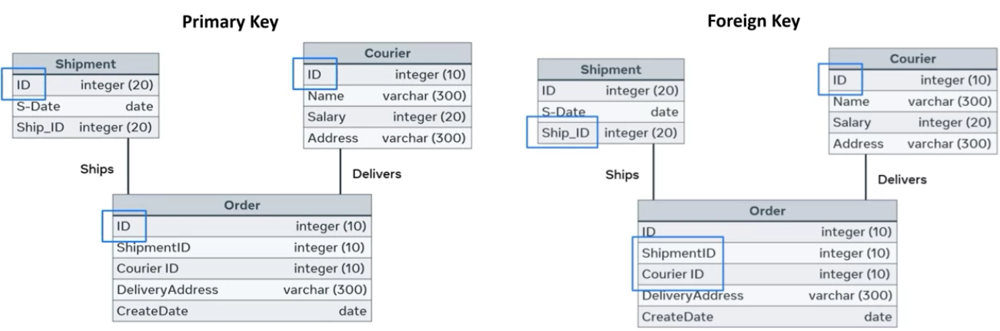

+++
title = "SQL Essentials"
date = 2024-08-13
author= ["Mehdi Azad"]
summary = "SQL commands for CRUD and Query as well as database desing"
+++

<h1 style="color: green"> 1- Data Query </h1>
 

## Select

```sql
SELECT column_name1, column_name2
FROM tale_name
LIMIT number_of_data;   #do not forget to put semi-colon at the end of the instruction

SELECT *
FROM table_name

SELECT shoe_type
	,shoe_ID
	,gender_identity
FROM Shoes
LIMIT 5;

```

## Select Distict

```sql
#selecting unique elements
SELECT DISTINCT CustomerID
FROM Orders

#return all unique (faculty, country) combination
SELECT DISTINCT faculty, country
FROM studnet_tble; 

```

## Math Operation

```sql
SELECT DISTINCT ProductID, 
,UnitPrice
,(UnitPrice - Discount) / Quantity AS TotalCost
FROM Product
```

### **Aggregate functions/operators**

Note: Aggregate functions are mainly used in group by command

```sql
SELECT MIN(UnitPrice) AS min_price, 
	MAX(UnitPrice) AS max_price, 
	AVG(UnitPrice) AS average_price
FROM table_name;

SELECT COUNT(*) AS total_customer     #Counts the total number of rows (containing Null)
FROM Customers;

SELECT COUNT(CustomerID) As total_customer #Counts total number of rows in a specific column (ignoring Nulls) 
FROM Customers
```

## Filter (Where)

```sql
SELECT column_name, column_name
FROM table_name
WHERE column_name operator value;

SELECT ProductName, 
UnitPrice, 
SupplierID
FROM Products
WHERE ProductName = 'Tufo'

WHERE UnitPrice >= 75;
WHERE ProductName <> 'Alice';
WHERE UnitPrice Between 15 And 80; 
WHERE ProductName is Null; 
WHERE size LIKE '%pizza'
WHERE faculty LIKE 'Sc%'

WHERE suplierID IN (9, 10, 11)
WHERE country IN ('USA','UK')
WHERE ProductName = 'Tufo' OR 'Konbu'
WHERE (SuplierID = 9 OR SuplierID = 11) AND UnitPrice > 15

SELECT *
FROM Employees 
WHERE NOT City = 'London' AND NOT City = 'Seattle'
WHERE date_of_birth BETWEEN '2020-01-01' AND '2010-06-01'
```

## Sort (Order By)

```sql
SELECT something
FROM database
ORDER BY charactristic;

SELECT column1, column2, ...
FROM table_name
ORDER BY column1, column2, ... ASC|DESC;

SELECT ID, first_name, last_name, date_of_birth, nationality
FROM student_tbl
ORDER BY nationality ASC, date_of_birth DESC;
```

## Aggregate (Group By)

Note: Aggregate functions are mainly used in group by command

```sql
SELECT 
	Region, 
	COUNT(CustomerID) AS total_customers
FROM product_list
GROUP BY Region;

```
<p align="center">

</p>


***Putting all filters together***

```sql
SELECT SupplierID,
COUNT(*) AS num_product
FROM Products
WHERE UnitPrice >= 4
GROUP BY SupplierID
HAVING COUNT(*) >= 2;   #because where works on rows not groups
```

## Get data form multiple tables

### Subquery

Note: subquery is a query inside another query

---

```sql
SELECT
CustomerID,
CompanyName,
Region
FROM Customers 
WHERE CustomerID IN (SELECT
	DISTINCT CustomerID
	FROM Orders
	WHERE Freight > 100);
```
<p align="center">

</p>

### inner join

```sql
SELECT supliers.CompanyName,
ProductName,
ProductPrice
FROM Supliers INNER JOIN Products ON supliers.suplierid = products.suplierid
```

Note: pre-qualify column name much cleaner and efficient

```sql
SELECT o.OrderID, c.CustomerID, e.Employee
FROM ((Orders o INNER JOIN Customers c ON o.CustomerID = c.CustomerID)
INNER JOIN Employee e ON e.EmployeeID = o.EmployeeID);
```

Application: we can use join to apply math operation on a table

```sql
#rising temperature for two consecutive dates
SELECT W2.id
FROM Weather W1 INNER JOIN Weather W2 
    ON DATEDIFF(W2.recordDate, W1.recordDate) = 1 AND W2.temperature > W1.temperature
```

### left Join

<p align="center">

</p>


```sql

Note: Inner join just join the rows existing in both tables. Does not output Null. 

```sql
select firstName, lastName, city, state
from Person p left join Address a on p.personID = a.personID
```

Groupby with Join

```sql
SELECT Shippers.ShipperName, COUNT(Orders.OrderID) AS NumberOfOrders 
FROM Orders LEFT JOIN Shippers ON Orders.ShipperID = Shippers.ShipperID
GROUP BY ShipperName;
```

<h1 style="color: Orange"> 2- CRUD Operations </h1>

### CRUD = Create, Read, Update, Delete

## Create a database

```sql
CREATE DATABASE database_name;
DROP DATABASE database_name; 
```

**USE database_name;** in Cloud Console workspaces

When you run the USE <database_name> statement in a Cloud Console workspace, **it sets the database that will be used in any subsequent CREATE statement requests for the specific editor cell**. Different cells can use different databases within the same workspace.

**SHOW TABLES;** show all the tabls in a database

## Creating new table

```sql
CREAT TABLE ...; 
```

```sql
CRATE TABLE shoes (
ID            char(5)         PRIMARY KEY
,type         varchar(250)       NOT NULL
,price        decimal(8, 2)   NOT NULL
,discription  varchar(750)       NULL); 

CREARTE TABLE players (
	name varchar(50) NOT NULL
	,city varchar(30) DEFAULT "Barcelona"
);

# if not specified the deault value is NULL
```

**SHOW COLUMNS FROM table_name;** displays information about the columns in a given table

**Data Types**

- Numeric
- String
- Date and Time

Numeric Data Types

- TINYINT
- INT
- Decimal

**String data types**

- char and varchar
- TINYTEXT             (like paragraphs)
- TEXT                      (like an article)
- MEDIUM TEXT    (like text of a book)
- LONGTEXT           (~4GB of data)

## Adding and Droping Columns in a Database

```sql
ALTER TABLE table_name ADD (column_name DATA TYPE);
ALTER TABLE table_name DROP COLUMN column_name;

ALTER TABLE students ADD (age INT, country VARCHAR(50), nationality VARCHAR(250));
ALTER TABLE students DROP COLUMN nationality;
ALTER TABLE studnets MODIFY country VARCHAR(100);
```

## Insert in to table

```sql
INSERT INTO shoes(
ID,
type,
price,
discription)
VALUES('1234','slippers','8900',NULL) , ('1235','running','10000',NULL);
```

## Create temporary table

```sql
CREATE TEMPORARY TABLE sandals AS
(
	SELECT *
	FROM shoes
	WHERE type = 'sandals'
);
```

## Update/correct a value in a table

```sql
Update Student_table
SET date_of_birth = '2000-10-12'
WHERE ID = 02;
```

## Delete data form a table

```sql
DELETE FROM Student_table
WHERE ID = 02; 
```


<h1 style="color: brown"> 3- Database Desing </h1>

## Designing Database Schema

Schema shows the components and the ralationship between the data components. This is also called Entity Relationship.  

Note: We use Primary and Foreing keys to create relations between tables and shape the schema of a database.



## Building a Schema

We use ERD (Entity Relationship Diagram) to show the database schema 

**Logical Level**

<p align="center">

</p>


**Physical Level**

```sql
CREATE TABLE tbl( 
    table_id INT, 
    location VARCHAR(255), 
    PRIMARY KEY (table_id) 
); 

CREATE TABLE waiter( 
    waiter_id INT, 
    name VARCHAR(150), 
    contact_no VARCHAR(10), 
    shift VARCHAR(10), 
    PRIMARY KEY (waiter_id) 
); 

CREATE TABLE table_order( 
    order_id INT, 
    date_time DATETIME, 
    table_id INT, 
    waiter_id INT, 
    PRIMARY KEY (order_id), 
    FOREIGN KEY (table_id) REFERENCES tbl(table_id), 
    FOREIGN KEY (waiter_id) REFERENCES waiter(waiter_id) 
); 

CREATE TABLE customer( 
    customer_id INT, 
    name VARCHAR(100), 
    NIC_no VARCHAR(12), 
    contact_no VARCHAR(10), 
    PRIMARY KEY (customer_id) 
); 

CREATE TABLE reservation( 
    reservation_id INT, 
    date_time DATETIME, 
    no_of_pax INT, 
    order_id INT, 
    table_id INT, 
    customer_id INT, 
    PRIMARY KEY (reservation_id), 
    FOREIGN KEY (order_id) REFERENCES table_order(table_id), 
    FOREIGN KEY (table_id) REFERENCES tbl(table_id), 
    FOREIGN KEY (customer_id) REFERENCES customer(customer_id) 
); 

CREATE TABLE menu( 
    menu_id INT, 
    description VARCHAR(255), 
    availability INT, 
    PRIMARY KEY (menu_id) 
); 

CREATE TABLE menu_item( 
    menu_item_id INT, 
    description VARCHAR(255), 
    price FLOAT, 
    availability INT, 
    menu_id INT, 
    PRIMARY KEY (menu_item_id), 
    FOREIGN KEY (menu_id) REFERENCES menu(menu_id) 
); 

CREATE TABLE order_menu_item( 
    order_id INT, 
    menu_item_id INT, 
    quantity INT, 
    PRIMARY KEY (order_id,menu_item_id), 
    FOREIGN KEY (order_id) REFERENCES table_order(order_id), 
    FOREIGN KEY (menu_item_id) REFERENCES menu_item(menu_item_id) 
); 
```

## Type of Relationships

<p align="center">


</p>


**Sample relationships**

<p align="center">


</p>


## Database Normalization

Database normamlization forms

- First normal form (1NF)
- Second normal form (2NF)
- Third normal form (3NF)

Desinging a database in 1NF (first normal form): solves the **Multiple Values** (in a column) and **Data Duplication** problems. 

Data Atomicity: We cannot have more than one values in a single field. For example the following table violates the atomicity rule in `Contact numbers` field. 


Solution I : Adding another column.

Issue: Repeated Data for Mart Evans


Solution II: Redesigning the tables


